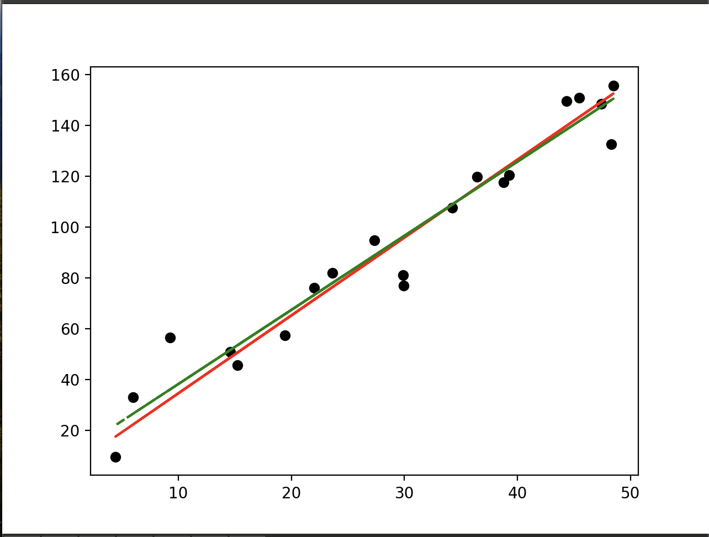

# Linear-Regression-from-Scratch

This project implements Linear Regression from scratch in Python, without using scikit-learn or other machine learning libraries. The dataset used is randomly generated to demonstrate the working of the model. 

To validate the implementation, the custom model’s performance is compared with scikit-learn’s LinearRegression. The Mean Squared Error (MSE) is computed for both models, and the results are visualized through comparison plots. 

The graphs show that predictions from both models are almost identical, with very minimal deviation, confirming the accuracy of the scratch implementation. 

The red line represents the predictions from the custom Linear Regression model, while the green line shows the predictions from scikit-learn’s LinearRegression.Both lines closely overlap, indicating that the scratch implementation performs almost identically to the scikit-learn model.

